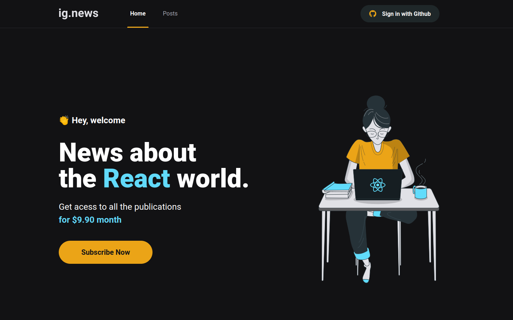

## 💻 Ignews



## ✨ Technologies

- Next JS
- Typescript
- Prismic
- Fauna DB
- Stripe
- CSS module
- Test with Jest

## 👨‍💻 Project

The project is a blog about React JS. You can simulate a subscription and to access through github.

## 🚀 How to run

- Clone the repository;
- In the cloned folder, install the dependencies with the following command:
  ```bash 
  yarn install
  ```

- Start the project with the command:
  ```bash
  yarn dev
  ``` 

## 🧪 How to run tests

- Run the tests with the command:
  ```bash 
  yarn test
  ```